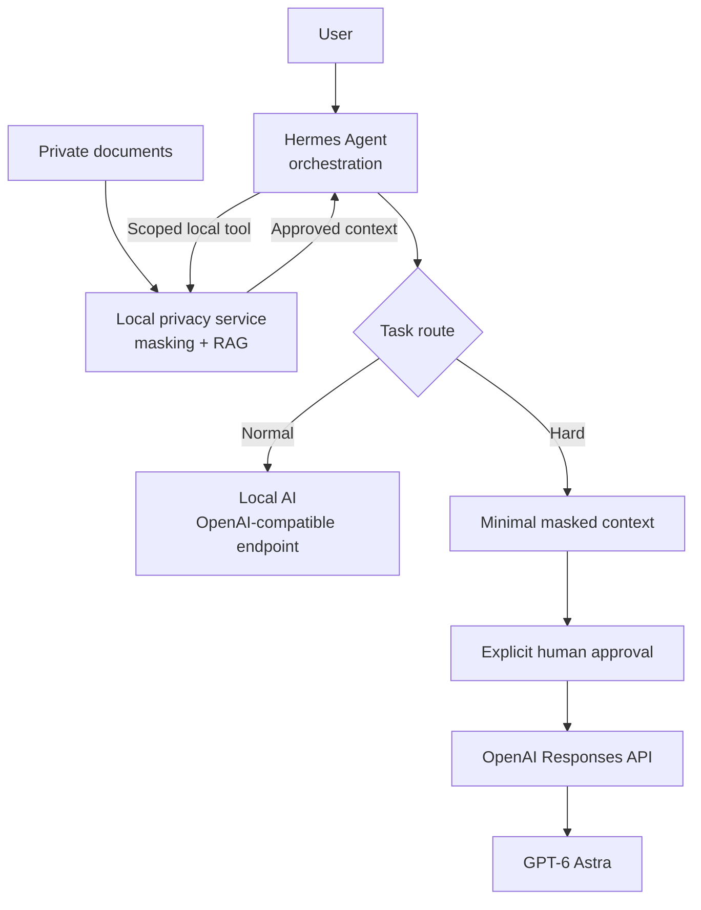

# Local AI + Hermes + GPT-6 Privacy Guide


คู่มือ Thai-first สำหรับออกแบบ workflow AI ที่ให้ข้อมูลอยู่ในเครื่องเป็นค่าเริ่มต้น และส่งขึ้น cloud เฉพาะบริบทที่ถูก mask และได้รับอนุมัติอย่างชัดเจนเท่านั้น

[](LICENSE) [](#อ่านต่อ) [](docs/architecture.md) [](docs/privacy-and-data-masking.md) [](docs/agent-era-with-hermes.md)

> นี่คือคู่มือเชิงหลักการ ไม่ใช่ production security control.

## English summary

This guide describes a local-first AI workflow for Thai-language data, with Hermes as the orchestration layer. Documents, PII detection, masking, retrieval, and normal AI work remain local by default. Only minimal masked context may cross an explicit, human-approved cloud gate for a hard task; there is no silent cloud fallback. The repository contains documentation and an offline dry-run payload example, not an installed or running local model.

> [!TIP]
> **Hermes + Local AI + masked cloud escalation** คือจุดที่แนวคิดนี้ลงตัวมาก: Hermes ช่วยประสาน workflow และเครื่องมือ, Local AI รับงานประจำ, ส่วน GPT-6 Astra รับเฉพาะงานยากที่ผ่าน local masking และการอนุมัติแล้ว ทั้งหมดนี้ยังต้องอาศัยการกำหนดสิทธิ์และ privacy boundary ที่ชัดเจน—Hermes ไม่ได้ทำให้ข้อมูลปลอดภัยโดยอัตโนมัติ

## เริ่มอ่านจากตรงไหน

| ถ้าต้องการ | เริ่มที่ |
| --- | --- |
| เห็นภาพระบบทั้งหมด | [สถาปัตยกรรม Local-first Hybrid AI](docs/architecture.md) |
| เข้าใจว่าทำไม Hermes จึงเหมาะกับยุค agent | [เมื่อ AI เริ่มลงมือแทนเรา: Local-first + Hermes](docs/agent-era-with-hermes.md) |
| ตรวจ payload โดยไม่เรียก API | [Safe masked Responses API example](examples/README.md) |

## แนวคิดในหนึ่งภาพ



Hermes อยู่ตรงกลางในฐานะ **orchestrator ไม่ใช่คลังข้อมูลดิบ**. แนวทางที่แนะนำคือให้ privacy service หรือเครื่องมือ local ที่ตรวจสอบได้เป็นผู้แตะเอกสารจริง ทำ masking/RAG และคืนเฉพาะบริบทที่ได้รับอนุญาต จากนั้น Hermes จึงเลือกเส้นทาง Local AI หรือ cloud gate ตามประเภทงาน

> [!WARNING]
> `scoped tool`, allowlist, redaction และ approval เป็น defense-in-depth แต่ไม่ใช่ containment. [Security Policy ของ Hermes](https://github.com/NousResearch/hermes-agent/blob/main/SECURITY.md) ระบุว่า OS-level isolation คือขอบเขตที่ใช้บังคับกับ adversarial LLM ได้จริง หากต้องกันเอกสารดิบจาก Hermes ให้แยก data/privacy service ด้วย OS account หรือ container ที่ไม่เปิด raw path ให้ agent และ expose เฉพาะ interface ที่จำเป็น

## หลักการ 5 ข้อ

1. **Local-first:** ไฟล์ต้นฉบับ, path, metadata, index, embeddings และ token map อยู่ในเครื่องเป็นค่าเริ่มต้น
2. **Data Masking ในเครื่อง:** ตรวจและแทนข้อมูลอ่อนไหวก่อน retrieval หรือ API egress; masking ลดความเสี่ยง แต่ไม่รับประกัน anonymization
3. **Minimal context:** งานที่ต้องใช้ cloud ส่งได้เฉพาะบริบทที่ mask แล้วและน้อยที่สุดเท่าที่ตอบงานได้
4. **Explicit approval:** ผู้ใช้ต้องเห็น masked preview และอนุมัติก่อน egress ทุกครั้ง
5. **No silent fallback:** Local AI ที่ล้มเหลวหรือคุณภาพไม่พอจะไม่เปลี่ยนไปใช้ cloud เอง

## อะไรอยู่ Local / อะไรขึ้น Cloud

| ขอบเขต | Local | Cloud ผ่าน explicit gate เท่านั้น |
| --- | --- | --- |
| เอกสารและตัวระบุ | ไฟล์ดิบ, path, metadata, token map | ไม่ส่ง |
| การเตรียมข้อมูล | OCR, PII detection, masking, local index, retrieval | ไม่ส่ง raw text หรือ raw file |
| งานปกติ | Local AI | ไม่เรียก API |
| งาน hard ที่อนุมัติแล้ว | สร้างและตรวจ masked preview ซ้ำ | minimal masked context เท่านั้น |

## Data Masking ตัวอย่าง

ตัวอย่างนี้เป็นข้อมูลสังเคราะห์และใช้ stable token เพื่อให้ระบบติดตามความหมายภายใน workflow local ได้ โดย token map ที่ย้อนกลับได้ต้องอยู่ในเครื่อง

```text
ก่อน mask: ผู้ติดต่อ SYNTHETIC_PERSON ขอให้สรุปรายการติดตาม
หลัง mask: ผู้ติดต่อ [[PERSON:A1]] ขอให้สรุปรายการติดตาม
```

`[[PERSON:A1]]` ไม่ใช่การ anonymize ที่รับประกันได้: บริบทหรือข้อมูลหลายแหล่งอาจยังเชื่อมกลับไปยังบุคคลได้ จึงต้องลดบริบท, ให้คนตรวจ preview และ scan ซ้ำก่อน egress.

## เลือกเส้นทางตามระบบ

| ระบบ | เส้นทาง | สถานะและสิ่งที่ต้องตรวจ |
| --- | --- | --- |
| Linux | vLLM ตามเอกสารหลัก | เป็นเส้นทาง primary; ตรวจ hardware, driver, Python, memory และ model support ก่อนติดตั้ง |
| Windows | Linux ภายใต้ WSL2 | ไม่มี native Windows support; ตรวจ WSL2, GPU/driver และ Linux guest ของตนเอง |
| macOS Apple Silicon | CPU experimental หรือ community `vllm-metal` | ไม่เทียบเท่า Linux-CUDA; ตรวจ model/hardware support และ toolchain ตามเอกสารต้นทาง |

ตารางนี้เป็นแผนที่สำหรับตัดสินใจเท่านั้น: repository นี้ไม่ติดตั้ง runtime, ไม่ดาวน์โหลด model และไม่รัน local model บนเครื่องของผู้อ่าน.

## Open Source ไม่เท่ากับ model license

Open Source runtime หรือ library อาจอนุญาตโค้ดของมัน แต่ไม่ได้อนุญาต model weights, tokenizer, model card, training data, fine-tune หรือการใช้งานเชิงพาณิชย์โดยอัตโนมัติ. ก่อนใช้งานจริงต้องตรวจ license และ policy ของแต่ละ model, revision, data และ intended use แยกจาก license ของ runtime.

## GPT-6 Astra API

ตัวอย่างใช้ model ID ที่แน่นอนคือ `gpt-6-astra` ผ่าน Responses API. Model access กำลังทยอยเปิดใช้ ดังนั้น API project ของผู้อ่านอาจยังไม่มีสิทธิ์ แม้ model ID จะอยู่ในเอกสาร; ให้ตรวจ access และเอกสารล่าสุดก่อน integration.

แนวคิดของ payload ที่ปลอดภัยคือสร้างจาก context ที่ mask แล้วเท่านั้น และตั้ง `store=False`:

```python
payload = build_payload(
    masked_context="ผู้ติดต่อ [[PERSON:A1]] ขอให้สรุปรายการติดตาม",
    question="สรุปรายการติดตาม โดยคง token ที่ถูก mask ไว้",
    model="gpt-6-astra",
)
assert payload["store"] is False
```

โค้ดข้างต้นไม่เรียก API. ดูการตรวจ payload และ `--dry-run` แบบเต็มได้ที่ [safe masked Responses API example](examples/README.md) และ [source code ของตัวอย่าง](examples/openai_responses_masked.py).

## อ่านต่อ

- [สถาปัตยกรรม Local-first Hybrid AI](docs/architecture.md)
- [เมื่อ AI เริ่มลงมือแทนเรา: Local-first + Hermes](docs/agent-era-with-hermes.md)
- [Open Source stack และการตรวจ license](docs/open-source-stack.md)
- [GPT-6 Astra และ OpenAI Responses API](docs/openai-api.md)
- [เลือกเส้นทาง Local AI ตามแพลตฟอร์ม](docs/platforms.md)
- [ความเป็นส่วนตัวและการ Mask ข้อมูลภาษาไทย](docs/privacy-and-data-masking.md)
- [Safe masked Responses API example](examples/README.md)

## ขอบเขตและคำเตือน

- คู่มือนี้ไม่ติดตั้ง software, ไม่ดาวน์โหลด model, ไม่รัน local model และไม่เรียก OpenAI API ระหว่างการจัดทำหรือการตรวจ repository
- Data Masking ไม่รับประกัน anonymization; OCR, detector, linkage และ re-identification อาจยังทำให้ข้อมูลอ่อนไหวหลงเหลือได้
- `store=False` ควบคุม application-state storage ของ Responses API สำหรับ request นั้น ไม่ใช่ **Zero Data Retention** (ZDR) และไม่แทนการอนุมัติ data controls หรือการประเมิน retention requirement ขององค์กร
- มีเพียง minimal masked context ที่ผ่าน local scan, preview และ explicit approval เท่านั้นที่ข้าม cloud gate ได้; ห้ามส่ง raw file, raw context, local path, token map หรือ fallback ไป cloud แบบเงียบ ๆ

## License / Security / Contributing

เผยแพร่ภายใต้ [MIT License](LICENSE). ก่อนใช้งานหรือส่ง contribution โปรดอ่าน [Security Policy](SECURITY.md) และ [Contributing guide](CONTRIBUTING.md).
