# เมื่อ AI เริ่มลงมือแทนเรา: Local-first + Hermes ในยุค Agent

คำว่า **AGI** อาจดึงความสนใจได้มาก แต่สำหรับคนที่ต้องนำ AI ไปใช้กับข้อมูลจริง คำถามที่สำคัญกว่าคือ:

> ระบบเห็นข้อมูลอะไร เรียกเครื่องมือใดได้ ทำอะไรได้ก่อนขออนุมัติ และเมื่อเกิดความผิดพลาดแล้วหยุดตรงไหน

ยิ่งโมเดลทำงานหลายขั้นตอน ใช้คอมพิวเตอร์ และเรียกเครื่องมือได้มาก ความสามารถของมันก็ยิ่งขยายผลจากสิทธิ์ที่เราให้ไว้ ระบบที่ดีจึงไม่ได้เลือกเพียง “โมเดลที่ฉลาดที่สุด” แต่ต้องออกแบบ **ขอบเขตอำนาจ เส้นทางข้อมูล และจุดอนุมัติ** ให้ชัดเจนด้วย

นี่คือเหตุผลที่การนำ **Hermes + Local AI + deterministic masking/RAG + GPT-6 Astra แบบเลือกใช้เฉพาะงานยาก** มาประสานกันลงตัวมาก: Hermes รับบทเป็นผู้ประสานงาน, งานส่วนใหญ่และข้อมูลละเอียดอยู่ในเครื่อง, ส่วน cloud รับเฉพาะบริบทขั้นต่ำที่ผ่านการปกปิดและการอนุมัติแล้ว

> [!IMPORTANT]
> เอกสารนี้เป็น **แนวทางสถาปัตยกรรม** ไม่ใช่คู่มือติดตั้งหรือใบรับรองความปลอดภัย Repository นี้ยังไม่ได้ติดตั้ง Local AI, ยังไม่ได้รัน Hermes workflow ตามภาพ และไม่ได้เรียก OpenAI API จริงบนเครื่องของผู้อ่าน

## สิ่งที่ยืนยันได้จากเอกสารทางการ

ข้อมูลในตารางนี้ตรวจจากเอกสารทางการ ณ วันที่ **4 กันยายน 2026** และอาจเปลี่ยนได้ตามการเปิดสิทธิ์หรือการปรับราคา

| ประเด็น | ข้อมูลที่ยืนยันได้ | ความหมายต่อสถาปัตยกรรมนี้ |
| --- | --- | --- |
| Model | Model ID คือ [`gpt-6-astra`](https://developers.openai.com/api/docs/models/gpt-6-astra) และ OpenAI วางตำแหน่งไว้สำหรับงาน end-to-end ที่ซับซ้อน เช่น reasoning, coding, computer use, research และ document creation | ใช้เป็น escalation model สำหรับงานยาก ไม่จำเป็นต้องรับทุกงาน |
| API และเครื่องมือ | [Model guidance](https://developers.openai.com/api/docs/guides/latest-model) แนะนำ Responses API และระบุว่า tool calling ของ Astra ต้องใช้ Responses; หน้ารุ่นระบุการรองรับ function calling, structured outputs, computer use, MCP และเครื่องมืออื่น | Cloud lane มีศักยภาพทำงานจริง จึงต้องจำกัด tool และสิทธิ์ ไม่ใช่ควบคุมเฉพาะ prompt |
| ราคา | ราคามาตรฐานที่ประกาศคือ **$10 ต่อ 1M input tokens** และ **$50 ต่อ 1M output tokens**; cached input และโหมดประมวลผลมีเงื่อนไขราคาแยก | ลดจำนวนครั้งที่เรียก cloud และลด context ก่อนส่ง มีผลต่อค่าใช้จ่ายโดยตรง |
| ต้นทุนต่องาน | OpenAI ระบุจากผลประเมินของตนว่า Astra บางกรณีใช้ output token น้อยลงและมี estimated API cost per task ต่ำกว่ารุ่นก่อน แม้ราคาต่อ token สูงกว่า | ควรวัดต้นทุนต่อ “งานที่เสร็จและผ่านเกณฑ์” แทนการดูราคา token เพียงค่าเดียว |
| การเฝ้าระวัง | เอกสาร OpenAI ระบุว่ามี asynchronous misalignment monitoring และการแจ้งเตือนเมื่อจำเป็น | เป็นชั้นของผู้ให้บริการ ไม่ใช่สิ่งทดแทน policy, masking และ approval gate ของระบบเรา |
| การเปิดสิทธิ์ | หน้ารุ่นระบุว่ากำลังทยอยเปิดผ่าน Trusted Access Program และจะขยายสู่ API/แผนอื่น | ต้องตรวจสิทธิ์ของ API project จริงก่อนออกแบบ production dependency |

หน้านี้จึงไม่ใช้คำประกาศเรื่อง AGI เป็นข้อสรุปทางเทคนิค และไม่ยกตัวเลข benchmark ที่ตรวจเงื่อนไขการรันจากแหล่งทางการชุดนี้ไม่ได้มาเป็นเหตุผลหลัก ความพร้อมของ agent ในงานจริงขึ้นอยู่กับทั้งโมเดล เครื่องมือ memory, permissions, data flow และระบบควบคุมที่ครอบมันอยู่

## จุดที่ Hermes ทำให้ภาพนี้ใช้งานได้จริง

[Hermes Agent](https://github.com/NousResearch/hermes-agent) รองรับการสลับผู้ให้บริการและ endpoint ของตนเอง ขณะที่ [เอกสาร provider](https://github.com/NousResearch/hermes-agent/blob/63279301bcbdc185c1b07b98a9312eb0c862f26d/website/docs/integrations/providers.md) ระบุ self-hosted endpoint อย่าง vLLM และ custom endpoint โดยตรง ส่วน [Local Models](https://github.com/NousResearch/hermes-agent/blob/63279301bcbdc185c1b07b98a9312eb0c862f26d/website/docs/user-guide/local-models.md) รองรับทั้ง managed llama.cpp และ OpenAI-compatible server ที่ผู้ใช้รันเอง

Hermes ยังเชื่อมความสามารถภายนอกผ่าน [MCP](https://github.com/NousResearch/hermes-agent/blob/63279301bcbdc185c1b07b98a9312eb0c862f26d/website/docs/user-guide/features/mcp.md) และจัดขั้นตอนเฉพาะงานผ่าน [Skills](https://github.com/NousResearch/hermes-agent/blob/63279301bcbdc185c1b07b98a9312eb0c862f26d/website/docs/user-guide/features/skills.md) ได้ ในสถาปัตยกรรมนี้ เราจึงให้ Hermes เป็น **orchestration layer** ที่ประสานส่วนต่าง ๆ ดังนี้

| ส่วนประกอบ | หน้าที่ที่ควรรับผิดชอบ |
| --- | --- |
| Hermes | รับโจทย์, เรียกเครื่องมือแบบจำกัดขอบเขต, เลือก local/cloud lane, แสดง masked preview และจัดจุดอนุมัติ |
| Local privacy service | อ่านไฟล์จริง, ตรวจ PII, สร้าง token, ทำ retrieval และคืนเฉพาะข้อมูลที่ policy อนุญาต |
| Local AI | รับงานประจำ เช่นจัดหมวดหมู่ สรุปเบื้องต้น และตอบจาก local RAG |
| Cloud egress gateway | บังคับ pre-egress scan, allowlist field, จำกัดขนาด payload, บันทึก audit แบบไม่เก็บข้อมูลดิบ และห้าม silent fallback |
| GPT-6 Astra | รับเฉพาะงานยากพร้อม minimal masked context หลังผู้ใช้อนุมัติ |

พูดแบบตรงไปตรงมา: **นี่คือจุดที่ Hermes ทำให้ชุดนี้ดีมาก** เพราะเราไม่ต้องผูก workflow ทั้งระบบกับโมเดลเดียว Hermes ประสาน provider, skill และ tool ได้ ส่วน privacy control ที่ต้องให้ผลแน่นอนยังคงอยู่ใน service ที่ตรวจสอบและทดสอบได้

Hermes ไม่ควรเป็นคลังเอกสารดิบ และ masking ไม่ควรฝากไว้กับคำสั่งภาษาธรรมชาติเพียงอย่างเดียว ทางที่ปลอดภัยกว่าคือเปิดให้ Hermes เห็นเครื่องมือแคบ ๆ เช่น `retrieve_masked_context` แทนเครื่องมือที่อ่านไฟล์ใดก็ได้ แล้วบังคับ policy ที่ชั้นโค้ดก่อนข้อมูลข้ามขอบเขต

## ภาพการไหลของข้อมูล

```mermaid
flowchart TB
    U[User] --> H

    subgraph DATA[OS/container-isolated data zone]
        D[Private documents] --> P[Privacy service<br/>PII scan + masking + RAG]
    end

    subgraph AGENT[Hermes execution zone]
        H[Hermes<br/>orchestration]
        H --> R{Task route}
        R -->|Normal| L[Local AI<br/>OpenAI-compatible endpoint]
        L --> H
        R -->|Hard| M[Minimal masked preview]
        M --> A{Human approval}
        A -->|Reject| H
    end

    H -->|Scoped local API| P
    P -->|Masked policy-approved context| H
    A -->|Approve only| E[Cloud egress gateway]
    E --> O[OpenAI Responses API<br/>gpt-6-astra]
    O --> H
```



หลักสำคัญคือ **ไฟล์ดิบไม่เดินตามลูกศรไป cloud** และ cloud lane ไม่เปิดเพราะ local model ตอบไม่ได้โดยอัตโนมัติ ทุกครั้งต้องสร้าง preview ใหม่ ตรวจซ้ำ และได้รับการอนุมัติก่อน

แผนภาพจงใจแยก data zone ออกจาก Hermes execution zone เพราะ scoped tool และ allowlist เป็นเพียง defense-in-depth ไม่ใช่ containment. **ขอบเขตความปลอดภัยที่บังคับได้จริง** ต้องมาจาก OS-level isolation: raw path ไม่ถูก mount หรือให้สิทธิ์แก่ Hermes และ agent ติดต่อ privacy service ได้ผ่าน interface แคบ ๆ เท่านั้น หากรับ input ที่ไม่เชื่อถือหรือใช้ใน production ควรครอบทั้ง Hermes process tree ด้วย OS/container policy ตาม threat model

## ชุดนี้เหมาะมากเมื่อใด

สถาปัตยกรรมนี้ให้ประโยชน์สูงเมื่อองค์กรหรือผู้ใช้มีเงื่อนไขต่อไปนี้

- งานส่วนใหญ่เป็นงานซ้ำ ๆ ที่ Local AI หรือ local RAG ทำได้ดีพอ
- มีเอกสารภายใน ข้อมูลลูกค้า หรือ PII ที่ไม่ควรถูกส่งออกทั้งก้อน
- งานยากมีสัดส่วนน้อยและสามารถรอ human approval ก่อนเรียก cloud ได้
- ต้องการเปลี่ยน local runtime ตามเครื่อง เช่น llama.cpp บน macOS หรือ vLLM บน Linux โดยไม่เขียน workflow ใหม่ทั้งหมด
- ต้องการต่อบริการเฉพาะทางผ่าน skill/MCP แต่ยังควบคุมรายการเครื่องมือและขอบเขตข้อมูลเอง
- ยอมวัดคุณภาพจริงด้วย completion rate, latency, ค่าใช้จ่าย และเหตุการณ์ข้อมูลหลุด แทนการตัดสินจาก benchmark เดียว

หากนโยบายกำหนดว่า **ห้ามมีข้อมูลออกนอกเครื่องทุกกรณี** ให้ปิด cloud lane ไปเลย ไม่ควรใช้ masking เป็นเหตุผลเพื่อฝ่าฝืนนโยบายนั้น และหากเป็นระบบ multi-tenant หรือ production ที่รับ input จากภายนอก สถาปัตยกรรมนี้ยังต้องเสริม identity, tenant isolation, network policy, incident response และการทดสอบด้านความปลอดภัยอีกมาก Hermes ถูกออกแบบเป็น single-tenant agent; caller ที่ผ่าน allowlist เดียวกันถือว่าได้รับความไว้วางใจเท่ากัน หากต้องแยก capability ระหว่างกลุ่มผู้ใช้ ให้ใช้ agent คนละ instance พร้อม allowlist และ OS boundary แยกกัน

## ความเป็นส่วนตัวไม่ได้เกิดขึ้นอัตโนมัติ

เอกสาร [Security Policy ของ Hermes](https://github.com/NousResearch/hermes-agent/blob/63279301bcbdc185c1b07b98a9312eb0c862f26d/SECURITY.md) ระบุชัดว่า Hermes เป็น single-tenant personal agent และมอง **OS-level isolation** เป็น security boundary ต่อ adversarial LLM; approval gate, redaction, scanner และ tool allowlist ภายใน process เป็นเพียง heuristic ไม่ใช่ containment

ดังนั้นคำว่า “ใช้ Hermes แล้ว private” ไม่ถูกต้องในตัวมันเอง ความเป็นส่วนตัวจะเกิดจากการประกอบระบบและการตั้งค่าที่รัดกุม:

1. **Mask แบบ deterministic** — ใช้ detector, rule และ test ที่ตรวจผลซ้ำได้; อย่าให้โมเดลตัดสินใจเองว่าควรลบข้อมูลใดทั้งหมด
2. **แยกสิทธิ์ด้วย OS/container** — จำกัดไฟล์, process และ network egress ตาม threat model; production หรือ input ที่ไม่เชื่อถือควรพิจารณา whole-process isolation
3. **ให้เครื่องมือเท่าที่จำเป็น** — review skill, plugin และ MCP ทั้ง source/command/permission ก่อนใช้ และเปิดเฉพาะ tool ที่ workflow ต้องการ
4. **บังคับ approval ที่ gateway** — ผู้ใช้ต้องเห็น payload ที่ mask แล้วจริง ไม่ใช่เพียงข้อความว่า “ระบบซ่อนข้อมูลให้แล้ว”
5. **ตรวจทุกเส้นทางออก** — รวม auxiliary model, web/search tool, telemetry, error report และ provider fallback; local main model ไม่ได้แปลว่าทุก tool ทำงาน local
6. **เก็บ token map ในเครื่อง** — logs และ audit record ต้อง redacted; ห้ามบันทึก raw prompt, file path, API key หรือข้อมูลที่ใช้ย้อน token กลับเป็นบุคคล
7. **retry แบบมีขอบเขต** — retry ได้เฉพาะ payload ที่ผ่าน scan เดิมและยังอยู่ใน policy ห้ามขยาย context หรือเปลี่ยนไป cloud อย่างเงียบ ๆ

## วัด “ราคาต่องานที่สำเร็จ”

การดูเพียงราคาต่อหนึ่งล้าน token ทำให้ตัดสินระบบ hybrid ได้ไม่ครบ เพราะ Local AI ก็มีต้นทุนเครื่อง ไฟฟ้า เวลา และการดูแล ขณะที่ cloud model ที่แพงต่อ token อาจจบงานได้ด้วยรอบที่น้อยกว่า

ตัวชี้วัดที่ตรงกว่าคือ:

```text
cost_per_completed_task =
  (local_compute + cloud_api + human_review + retry_and_failure_cost)
  / completed_tasks_that_pass_quality_checks
```

สำหรับ stack นี้ควรเก็บอย่างน้อย 5 ค่า: อัตรางานที่จบใน local lane, อัตรา escalation, จำนวน byte/token ที่ออกนอกเครื่อง, เวลารออนุมัติ และต้นทุนต่องานที่ผ่านเกณฑ์ หาก GPT-6 Astra ถูกเรียกเฉพาะโจทย์ที่ Local AI ไม่คุ้มจะทำ และได้รับ context เท่าที่จำเป็น ราคาต่อ token ที่สูงขึ้นก็อาจแลกกับคุณภาพและจำนวนรอบที่ดีกว่าได้—แต่ต้องพิสูจน์ด้วยข้อมูลของ workflow จริง ไม่ใช่สมมติจากชื่อรุ่น

## ลำดับการทำงานที่แนะนำ

1. ผู้ใช้ส่งคำขอให้ Hermes โดยยังไม่มีสิทธิ์ cloud egress
2. Hermes เรียก local privacy service ด้วย tool ที่จำกัด scope
3. Privacy service ทำ PII detection, masking และ retrieval จากเอกสารในเครื่อง
4. Local AI พยายามทำงานก่อนและส่งผลพร้อมหลักฐานจาก local RAG
5. ถ้างานยากจริง ระบบสร้าง minimal masked context และสแกนซ้ำ
6. ผู้ใช้ตรวจ preview แล้วอนุมัติหรือปฏิเสธอย่างชัดแจ้ง
7. เมื่ออนุมัติเท่านั้น egress gateway จึงเรียก `gpt-6-astra` ผ่าน Responses API และคืนผลกลับเข้า Hermes

## Checklist ก่อนนำแนวคิดไปสร้างจริง

- [ ] นิยามว่าอะไรคือข้อมูลดิบ ข้อมูลอ่อนไหว และข้อมูลที่อนุญาตให้ออกนอกเครื่อง
- [ ] แยก privacy service ออกจาก prompt และมี test สำหรับ PII ภาษาไทยที่ใช้จริง
- [ ] ให้ Hermes เรียกเฉพาะ scoped tool; ไม่เปิด raw filesystem โดยปริยาย
- [ ] ผูก Local AI กับ loopback/private network และตรวจว่าไม่มี silent cloud fallback
- [ ] ตรวจ provider ของ auxiliary task และ network tool ทุกตัว
- [ ] แสดง masked preview พร้อมปลายทางและเหตุผลก่อนอนุมัติ
- [ ] จำกัด payload, timeout และจำนวน retry ที่ cloud egress gateway
- [ ] review source และ permission ของ skill, plugin และ MCP ก่อนเปิดใช้
- [ ] ทำ redacted audit log และเก็บ token vault เฉพาะในเครื่อง
- [ ] วัด quality, latency, egress volume และ cost per completed task จากงานจริง

## แหล่งอ้างอิงปฐมภูมิ

### OpenAI

- [GPT-6 Astra model page](https://developers.openai.com/api/docs/models/gpt-6-astra)
- [GPT-6 Astra model guidance](https://developers.openai.com/api/docs/guides/latest-model)

### Hermes / Nous Research

- [Hermes Agent repository](https://github.com/NousResearch/hermes-agent)
- [Official provider documentation](https://github.com/NousResearch/hermes-agent/blob/63279301bcbdc185c1b07b98a9312eb0c862f26d/website/docs/integrations/providers.md)
- [Official local-model documentation](https://github.com/NousResearch/hermes-agent/blob/63279301bcbdc185c1b07b98a9312eb0c862f26d/website/docs/user-guide/local-models.md)
- [Official MCP documentation](https://github.com/NousResearch/hermes-agent/blob/63279301bcbdc185c1b07b98a9312eb0c862f26d/website/docs/user-guide/features/mcp.md)
- [Official Skills documentation](https://github.com/NousResearch/hermes-agent/blob/63279301bcbdc185c1b07b98a9312eb0c862f26d/website/docs/user-guide/features/skills.md)
- [Hermes Agent Security Policy](https://github.com/NousResearch/hermes-agent/blob/63279301bcbdc185c1b07b98a9312eb0c862f26d/SECURITY.md)

ข้อสรุปของแนวทางนี้เรียบง่าย: **ให้ Hermes ประสานงาน ให้ Local AI รับงานส่วนใหญ่ ให้ privacy service คุมข้อมูลดิบ และให้ GPT-6 Astra รับเฉพาะงานยากหลังผ่าน gate** ความน่าสนใจไม่ได้อยู่ที่การประกาศว่าเราถึง AGI แล้วหรือยัง แต่อยู่ที่เราสามารถใช้ agent ที่เก่งขึ้นโดยยังรักษาขอบเขตอำนาจของมันไว้ได้หรือไม่
