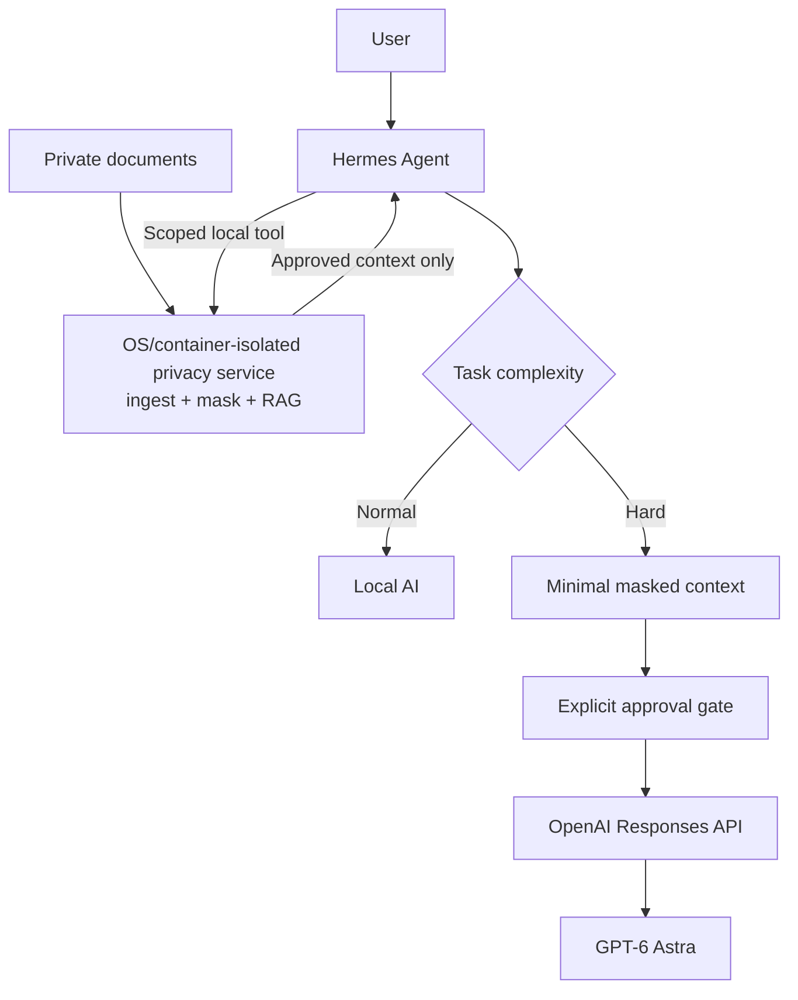

# สถาปัตยกรรม Local-first Hybrid AI

## เป้าหมายของสถาปัตยกรรม

คู่มือนี้วางระบบให้ประมวลผลเอกสาร การค้นหา และคำตอบทั่วไปในเครื่องเป็นค่าเริ่มต้น (local-first) เพื่อให้ไฟล์และบริบทละเอียดอยู่ภายในขอบเขตที่ผู้ใช้ควบคุมได้ โดยใช้ Hermes เป็นชั้น orchestration ที่เรียกเครื่องมือแบบจำกัดขอบเขตและเลือกเส้นทางประมวลผล การใช้ cloud มีไว้สำหรับงานยากที่ local AI ทำไม่ได้หรือคุณภาพไม่พอเท่านั้น และต้องส่งบริบทที่น้อยที่สุดซึ่งผ่านการ masking และการอนุมัติแล้ว

ตัวอย่าง `gpt-6-astra` ใน repository รับเฉพาะบริบทสังเคราะห์ที่ถูก mask มาแล้ว ไม่ใช่ production masker หรือระบบ RAG ที่พร้อมใช้งานจริง การส่งออกไปยัง cloud ของตัวอย่างต้องเลือก `--send` อย่างชัดแจ้ง

## Data flow

แผนภาพ Mermaid ต่อไปนี้เป็น canonical data flow ของระบบเป้าหมาย การตรวจจับ PII, masking, retrieval และการตัดสินใจส่งออกเกิดในเครื่องก่อนถึง API ภายนอกเสมอ

เส้นทาง `Normal` ตอบจาก Local AI และไม่เปิด API egress ส่วนเส้นทาง `Hard` สร้างเฉพาะ chunk ที่จำเป็นจากผล retrieval ที่ mask แล้ว จึงอาจส่งเป็น minimal masked context ไปยัง OpenAI Responses API ได้หลังผ่าน decision gate เท่านั้น ในแบบนี้ Hermes เป็น control plane ไม่ใช่ที่เก็บเอกสาร: raw file ควรอยู่หลัง privacy service และไม่ควรถูกเปิดให้ agent อ่านโดยปริยาย

## ขอบเขตความปลอดภัยที่บังคับได้จริง

[Security Policy ของ Hermes](https://github.com/NousResearch/hermes-agent/blob/63279301bcbdc185c1b07b98a9312eb0c862f26d/SECURITY.md) ระบุว่า **OS-level isolation เป็น security boundary เดียวสำหรับ adversarial LLM**. `scoped tool`, allowlist, approval gate, scanner และ redaction ช่วยลดความผิดพลาด แต่ไม่ใช่ containment เพราะ terminal, code execution, plugin หรือ MCP ที่รันภายใต้สิทธิ์เดียวกันอาจเข้าถึงทรัพยากรของ OS user นั้นได้

หากต้องบังคับว่า Hermes แตะเอกสารดิบไม่ได้ ต้องแยก privacy service และ data vault ด้วย OS account หรือ container ที่ไม่ mount raw path เข้า agent แล้ว expose เฉพาะ local interface ที่จำเป็น สำหรับ production, shared deployment หรือ input ที่ไม่เชื่อถือ ควรใช้ whole-process wrapping เพื่อครอบทั้ง Hermes process tree ตาม threat model ไม่ใช่ sandbox เฉพาะ terminal

## Data zones และ trust boundaries

| ขอบเขต | สิ่งที่อยู่ภายใน | กติกา |
| --- | --- | --- |
| Source files | ไฟล์ต้นฉบับ, path และ metadata ของผู้ใช้ | อยู่ใน OS account/container ที่ Hermes อ่านไม่ได้; ไม่เป็น payload ของ cloud |
| Hermes orchestration | routing, tool calls และสถานะงานที่จำเป็น | allowlist เฉพาะ skill/tool ที่ตรวจแล้วเป็น defense-in-depth; ใช้ OS isolation เป็น boundary จริง |
| Local index | chunks, embeddings และ metadata สำหรับ RAG | ถือเป็นข้อมูลอ่อนไหว แม้ไม่มีไฟล์ดิบ; จำกัดสิทธิ์และลบตาม retention policy |
| Masking/token vault | ตัวตรวจ PII, token ที่ opaque และ token map สำหรับเชื่อมกลับ | token map อยู่ในเครื่องและไม่ออกนอกเครื่อง |
| Local model endpoint | OCR, detector, retrieval และ Local AI | ใช้ตอบงานปกติ; ห้าม fallback ไป cloud แบบเงียบ ๆ |
| API egress | minimal masked context ที่ผู้ใช้ตรวจแล้ว | เป็นขอบเขตออกนอกเครื่อง; ส่งได้เมื่อผ่าน gate เท่านั้น |

## Decision gate

1. Local AI เป็นค่าเริ่มต้น และเลือก cloud เฉพาะงานที่ระบุว่า hard
2. ระบบสร้าง masked preview ของบริบทขั้นต่ำที่ตั้งใจจะส่ง แล้วให้ผู้ใช้ตรวจและอนุมัติ
3. หาก detector หรือ OCR มีความมั่นใจต่ำ, preview มีข้อมูลหลงเหลือ, หรือผู้ใช้ไม่อนุมัติ ให้ block egress และขอให้ตรวจแก้ในเครื่อง
4. หลังอนุมัติ ต้อง scan ซ้ำก่อน egress; ส่งเฉพาะ payload ที่ผ่าน scan นั้น

## ข้อมูลที่ห้ามส่ง

ห้ามส่งสิ่งต่อไปนี้ผ่าน API egress ไม่ว่าจะเพื่อ debug, retry หรือทำให้คำตอบดีขึ้น:

- ไฟล์ดิบหรือเนื้อหาต้นฉบับที่ยังไม่ mask
- path ภายในเครื่องหรือชื่อโฟลเดอร์ที่ระบุต้นทางได้
- original identifiers เช่น ชื่อจริง เลขประจำตัว หรือรหัสเคสก่อน masking
- token maps หรือข้อมูลที่ใช้ย้อน token กลับเป็นตัวจริง
- logs, prompt ดิบ, chunks ดิบ หรือ metadata ที่ไม่เกี่ยวกับงาน

## Failure behavior

- เมื่อ retrieval ไม่พบหลักฐาน ให้ตอบว่าไม่พบข้อมูลในดัชนี; ห้ามสร้างคำตอบเพื่อกลบช่องว่าง (no retrieval hallucination)
- เมื่อ Local AI ล้มเหลวหรือคุณภาพไม่พอ ห้ามเปลี่ยนไปใช้ cloud model แบบ silent model fallback; ต้องผ่าน decision gate ใหม่
- เมื่อ masking, OCR หรือ pre-egress scan ล้มเหลว ให้หยุด egress และแสดงเหตุที่แก้ไขได้ในเครื่องโดยไม่แสดงข้อมูลดิบใน log
- timeout หรือ rate limit อาจ retry ได้เฉพาะ masked payload เดิม ภายใต้จำนวนครั้งที่กำหนดและหลังตรวจว่ายังผ่านนโยบาย; ห้าม retry ด้วย raw data หรือบริบทที่กว้างขึ้น

## Threat-model limit

แนวทางนี้ลดการส่งข้อมูลออกนอกเครื่อง แต่ไม่กำจัดความเสี่ยงทั้งหมด โดยเฉพาะ same-user compromise (ผู้โจมตีเข้าบัญชีผู้ใช้เดียวกัน), malicious plugins, device theft และ re-identification จากการเชื่อมข้อมูลหลายแหล่ง ผู้ใช้งานต้องใช้การเข้ารหัสดิสก์, การควบคุมสิทธิ์, การตรวจ plugin และนโยบาย incident response เพิ่มเติมตามบริบทของตน
