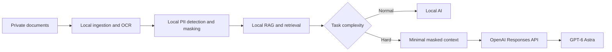

# Local AI + GPT-6 Privacy Guide Implementation Plan

> **For agentic workers:** REQUIRED SUB-SKILL: Use superpowers:subagent-driven-development (recommended) or superpowers:executing-plans to implement this plan task-by-task. Steps use checkbox (`- [ ]`) syntax for tracking.

**Goal:** Build and publish a Thai-first public documentation repository that explains local Open Source RAG and data masking before optional escalation to the OpenAI GPT-6 Astra Responses API.

**Architecture:** The repository is documentation-first: focused Markdown pages carry the architecture, platform, privacy, licensing, and API contracts, while one standard-library-friendly Python example demonstrates a masked `gpt-6-astra` request in dry-run mode. Verification is offline and checks file inventory, documentation contracts, local links, Python syntax, dry-run behavior, and secret absence before the exact local commit is pushed to a public GitHub repository.

**Tech Stack:** Markdown, Mermaid, Python 3 standard library, optional OpenAI Python SDK for reader-initiated live use, Git, GitHub CLI

**Spec:** `docs/superpowers/specs/2026-09-04-local-ai-gpt6-privacy-guide-design.md`

## Global Constraints

- Repository name is exactly `local-ai-gpt6-privacy-guide` and visibility is public.
- README is Thai-first and includes a concise English summary.
- This implementation must not install or run vLLM/vLLM-Metal, download model weights, or alter Local AI configuration on the authoring machine.
- Verification must not call the OpenAI API or require `OPENAI_API_KEY`.
- The OpenAI example uses Responses API model `gpt-6-astra` and sets `store=False`.
- Only synthetic data may appear in examples and tests; no real PII, credentials, internal paths, or customer data.
- Documentation must state that masking is not guaranteed anonymization and `store=False` is not equivalent to Zero Data Retention.
- Documentation must distinguish Open Source runtime software from separately licensed open-weight model files.
- Linux is the primary vLLM path; Windows uses WSL2; macOS Apple Silicon uses experimental CPU support or community `vllm-metal` with explicit caveats.
- No source file may claim that one `pip install vllm` workflow works identically on macOS, native Windows, and Linux.
- Every task ends in a reviewable commit and leaves the test commands listed in that task passing.

---

## File Map

| Path | Responsibility |
| --- | --- |
| `README.md` | Thai-first landing page, English summary, core diagram, scope, quick reading path |
| `LICENSE` | MIT license for repository-authored code and documentation |
| `SECURITY.md` | Private reporting path and sensitive-data handling rules |
| `CONTRIBUTING.md` | Contribution rules, synthetic-data requirement, source/license requirements |
| `.env.example` | Variable names only; no credential value |
| `.gitignore` | Prevent secrets, virtual environments, caches, and OS files from entering Git |
| `assets/README.md` | Rules for later screenshots, redaction, attribution, and filenames |
| `docs/architecture.md` | End-to-end data flow, trust boundaries, escalation and failure paths |
| `docs/privacy-and-data-masking.md` | Thai PII categories, masking pipeline, consent, retention, limitations |
| `docs/platforms.md` | Honest macOS, Windows/WSL2, and Linux paths and constraints |
| `docs/open-source-stack.md` | Local component roles and license boundary |
| `docs/openai-api.md` | GPT-6 Astra Responses API, access, `store=False`, retention, key safety |
| `examples/README.md` | Explains safe dry-run use and why the example is not a production masker |
| `examples/openai_responses_masked.py` | Builds and prints a masked request; live sending requires explicit `--send` |
| `tests/test_openai_responses_masked.py` | Unit and subprocess coverage for payload and dry-run safety |
| `tests/test_docs_contract.py` | Required files, key claims, local-link integrity, and secret-pattern checks |

### Task 1: Repository policy and publishing-safe scaffolding

**Files:**
- Create: `.gitignore`
- Create: `.env.example`
- Create: `LICENSE`
- Create: `SECURITY.md`
- Create: `CONTRIBUTING.md`
- Create: `assets/README.md`

**Interfaces:**
- Consumes: Repository name and public-release constraints from the approved spec.
- Produces: A secret-safe public repository baseline used by every later task.

- [ ] **Step 1: Create the ignore and environment templates**

Create `.gitignore` with exactly:

```gitignore
.env
.env.*
!.env.example
.venv/
venv/
__pycache__/
*.py[cod]
.pytest_cache/
.DS_Store
```

Create `.env.example` with exactly:

```dotenv
# Copy to .env only if you intentionally run the live API example.
OPENAI_API_KEY=
OPENAI_MODEL=gpt-6-astra
```

- [ ] **Step 2: Add the MIT license**

Create `LICENSE` with the standard MIT License text, copyright line:

```text
Copyright (c) 2026 Vittawat
```

The remaining license text must match the canonical MIT terms from “Permission is hereby granted” through the warranty disclaimer.

- [ ] **Step 3: Add security and contribution policies**

Create `SECURITY.md` with these exact sections and rules:

```markdown
# Security Policy

## Report a vulnerability

Do not open a public issue containing credentials, personal data, internal documents, or a working exploit. Use GitHub's private security advisory flow for this repository.

## Sensitive-data rule

This repository accepts synthetic examples only. Revoke and rotate any credential accidentally committed before reporting it. Data masking reduces exposure but does not guarantee anonymization.

## Scope

This project is an educational guide, not a production security control, compliance certification, or legal opinion.
```

Create `CONTRIBUTING.md` with sections `Before contributing`, `Content rules`, `Verification`, and `Pull requests`. Require synthetic data, primary-source links, exact dependency/model licenses, no secrets, and these verification commands:

```bash
python3 -m unittest discover -s tests -v
python3 -m py_compile examples/openai_responses_masked.py
python3 examples/openai_responses_masked.py --dry-run
git diff --check
```

- [ ] **Step 4: Add the future-image policy**

Create `assets/README.md` stating:

- Images are optional and added only after review.
- Screenshots must redact names, phone numbers, email addresses, tokens, API keys, account identifiers, internal paths, and notifications.
- Use synthetic demo content.
- Use lowercase kebab-case filenames and include source/author/license notes.
- Recheck the final rendered image rather than relying only on the source editor.

- [ ] **Step 5: Verify the scaffold**

Run:

```bash
test -f .gitignore
test -f .env.example
test -f LICENSE
test -f SECURITY.md
test -f CONTRIBUTING.md
test -f assets/README.md
test ! -e .env
git diff --check
```

Expected: every command exits 0 and no output contains a credential value.

- [ ] **Step 6: Commit**

```bash
git add .gitignore .env.example LICENSE SECURITY.md CONTRIBUTING.md assets/README.md
git commit -m "docs: add repository policies and security baseline"
```

### Task 2: Safe masked Responses API example

**Files:**
- Create: `tests/test_openai_responses_masked.py`
- Create: `examples/openai_responses_masked.py`
- Create: `examples/README.md`

**Interfaces:**
- Consumes: `OPENAI_MODEL` and `OPENAI_API_KEY` variable names from `.env.example`.
- Produces: `build_payload(masked_context: str, question: str, model: str) -> dict[str, object]`, `assert_raw_markers_absent(payload: dict[str, object], raw_markers: tuple[str, ...]) -> None`, and `main(argv: list[str] | None = None) -> int`.

- [ ] **Step 1: Write the failing example tests**

Create `tests/test_openai_responses_masked.py`:

```python
from __future__ import annotations

import json
import subprocess
import sys
import unittest
from pathlib import Path

ROOT = Path(__file__).resolve().parents[1]
sys.path.insert(0, str(ROOT))

from examples.openai_responses_masked import (  # noqa: E402
    SYNTHETIC_RAW_MARKERS,
    assert_raw_markers_absent,
    build_payload,
)


class MaskedPayloadTests(unittest.TestCase):
    def test_payload_uses_gpt6_responses_shape_without_storage(self) -> None:
        payload = build_payload(
            masked_context="ลูกค้า [[PERSON:A1]] ติดต่อผ่าน [[PHONE:B2]]",
            question="สรุปประเด็นที่ต้องติดตาม",
            model="gpt-6-astra",
        )

        self.assertEqual(payload["model"], "gpt-6-astra")
        self.assertIs(payload["store"], False)
        self.assertIn("[[PERSON:A1]]", str(payload["input"]))
        self.assertIn("[[PHONE:B2]]", str(payload["input"]))

    def test_raw_marker_guard_rejects_leak(self) -> None:
        with self.assertRaises(ValueError):
            assert_raw_markers_absent(
                {"input": "SYNTHETIC_RAW_MARKER_DO_NOT_SEND"},
                SYNTHETIC_RAW_MARKERS,
            )

    def test_dry_run_is_offline_and_contains_no_raw_marker(self) -> None:
        completed = subprocess.run(
            [
                sys.executable,
                str(ROOT / "examples" / "openai_responses_masked.py"),
                "--dry-run",
            ],
            check=True,
            capture_output=True,
            text=True,
        )
        payload = json.loads(completed.stdout)
        self.assertEqual(payload["model"], "gpt-6-astra")
        self.assertIs(payload["store"], False)
        for marker in SYNTHETIC_RAW_MARKERS:
            self.assertNotIn(marker, completed.stdout)


if __name__ == "__main__":
    unittest.main()
```

- [ ] **Step 2: Run the tests and confirm the expected failure**

Run:

```bash
python3 -m unittest tests/test_openai_responses_masked.py -v
```

Expected: FAIL because `examples.openai_responses_masked` does not exist.

- [ ] **Step 3: Implement the minimal safe example**

Create `examples/openai_responses_masked.py`:

```python
from __future__ import annotations

import argparse
import json
import os
from typing import Any

DEFAULT_MODEL = os.getenv("OPENAI_MODEL", "gpt-6-astra")
SYNTHETIC_RAW_MARKERS = ("SYNTHETIC_RAW_MARKER_DO_NOT_SEND",)
MASKED_CONTEXT = (
    "ลูกค้า [[PERSON:A1]] ติดต่อผ่าน [[PHONE:B2]] "
    "เรื่องคำสั่งซื้อ [[ORDER:C3]]"
)
QUESTION = "สรุปประเด็นและรายการติดตาม โดยคง token ที่ถูก mask ไว้"


def build_payload(
    masked_context: str,
    question: str,
    model: str = DEFAULT_MODEL,
) -> dict[str, object]:
    if not masked_context.strip() or not question.strip():
        raise ValueError("masked_context and question must not be empty")
    return {
        "model": model,
        "store": False,
        "instructions": (
            "Use only the supplied masked context. Preserve masking tokens. "
            "Do not infer or reconstruct personal data."
        ),
        "input": f"MASKED CONTEXT:\n{masked_context}\n\nQUESTION:\n{question}",
    }


def assert_raw_markers_absent(
    payload: dict[str, object],
    raw_markers: tuple[str, ...],
) -> None:
    serialized = json.dumps(payload, ensure_ascii=False, sort_keys=True)
    leaked = [marker for marker in raw_markers if marker in serialized]
    if leaked:
        raise ValueError("raw synthetic marker detected; refusing egress")


def parse_args(argv: list[str] | None = None) -> argparse.Namespace:
    parser = argparse.ArgumentParser(
        description="Build a masked GPT-6 Astra Responses API request."
    )
    mode = parser.add_mutually_exclusive_group(required=True)
    mode.add_argument("--dry-run", action="store_true")
    mode.add_argument("--send", action="store_true")
    return parser.parse_args(argv)


def main(argv: list[str] | None = None) -> int:
    args = parse_args(argv)
    payload = build_payload(MASKED_CONTEXT, QUESTION)
    assert_raw_markers_absent(payload, SYNTHETIC_RAW_MARKERS)

    if args.dry_run:
        print(json.dumps(payload, ensure_ascii=False, indent=2))
        return 0

    if not os.getenv("OPENAI_API_KEY"):
        raise SystemExit("OPENAI_API_KEY is required for --send")

    from openai import OpenAI

    client = OpenAI()
    response: Any = client.responses.create(**payload)
    print(response.output_text)
    return 0


if __name__ == "__main__":
    raise SystemExit(main())
```

- [ ] **Step 4: Add the example safety explanation**

Create `examples/README.md` with:

- `--dry-run` is the only mode used by repository verification.
- `--send` is opt-in and requires the reader to install the OpenAI SDK and provide `OPENAI_API_KEY` themselves.
- The script receives already-masked synthetic context; it is not a PII detector.
- Production systems need a local detector, human preview/approval, second egress scan, bounded retry, and redacted logging.
- `store=False` does not grant Zero Data Retention.

- [ ] **Step 5: Run tests, compile, and dry-run**

```bash
python3 -m unittest tests/test_openai_responses_masked.py -v
python3 -m py_compile examples/openai_responses_masked.py
python3 examples/openai_responses_masked.py --dry-run > /tmp/local-ai-gpt6-dry-run.json
python3 -m json.tool /tmp/local-ai-gpt6-dry-run.json >/dev/null
! rg -n "SYNTHETIC_RAW_MARKER_DO_NOT_SEND" /tmp/local-ai-gpt6-dry-run.json
```

Expected: three tests PASS, compilation succeeds, dry-run JSON is valid, and the raw marker is absent.

- [ ] **Step 6: Commit**

```bash
git add examples tests/test_openai_responses_masked.py
git commit -m "feat: add offline masked GPT-6 request example"
```

### Task 3: Architecture and privacy documentation

**Files:**
- Create: `docs/architecture.md`
- Create: `docs/privacy-and-data-masking.md`

**Interfaces:**
- Consumes: The `gpt-6-astra` masked payload contract from Task 2.
- Produces: The canonical data-flow and privacy rules linked by README and the API/platform pages.

- [ ] **Step 1: Write the architecture page**

Create `docs/architecture.md` with these sections:

1. `เป้าหมายของสถาปัตยกรรม` — local-first, cloud only for hard tasks.
2. `Data flow` — Mermaid diagram from private documents through local OCR, masking, RAG, task routing, local answer or minimal masked GPT-6 context.
3. `Trust boundaries` — source files, local index, masking/token vault, local model endpoint, API egress.
4. `Decision gate` — local is default; user reviews masked preview; low confidence blocks egress.
5. `ข้อมูลที่ห้ามส่ง` — raw files, paths, original identifiers, token maps, logs, unrelated metadata.
6. `Failure behavior` — no retrieval hallucination, no silent model fallback, masked-only bounded retries.
7. `Threat-model limit` — same-user compromise, malicious plugins, device theft, and re-identification remain risks.

Use this diagram:



- [ ] **Step 2: Write the Thai privacy page**

Create `docs/privacy-and-data-masking.md` with:

- A prominent warning: masking is risk reduction, not guaranteed anonymization.
- Thai categories: person name, email, phone, Thai national ID with checksum, account/PromptPay, address, customer/employee/HN/AN/case IDs, organization/project secrets.
- Six-stage flow: Unicode and Thai-digit normalization; rule/checksum plus Thai-aware NER; stable opaque tokens; preview/approval; retrieval; second pre-egress scan.
- Consent choices: metadata-only, mask-and-index, session-only, cancel.
- Retention and deletion guidance covering raw files, chunks, embeddings, caches, token maps, logs, and backups.
- OCR, false-negative, false-positive, linkage, embedding leakage, and prompt-injection caveats.
- Synthetic examples only:

```text
ก่อน: ลูกค้า SYNTHETIC_PERSON ติดต่อ SYNTHETIC_PHONE
หลัง: ลูกค้า [[PERSON:A1]] ติดต่อ [[PHONE:B2]]
```

- [ ] **Step 3: Verify the two documents**

```bash
rg -n "Local|Mermaid|Trust|ห้ามส่ง|Failure|Threat" docs/architecture.md
rg -n "ไม่รับประกัน|เลขบัตรประชาชน|checksum|PromptPay|preview|embeddings|OCR" docs/privacy-and-data-masking.md
git diff --check
```

Expected: every required topic is matched and formatting is clean.

- [ ] **Step 4: Commit**

```bash
git add docs/architecture.md docs/privacy-and-data-masking.md
git commit -m "docs: explain hybrid architecture and Thai data masking"
```

### Task 4: Platform, Open Source, and OpenAI API reference pages

**Files:**
- Create: `docs/platforms.md`
- Create: `docs/open-source-stack.md`
- Create: `docs/openai-api.md`

**Interfaces:**
- Consumes: Architecture/privacy boundaries from Task 3 and payload behavior from Task 2.
- Produces: Source-backed platform, licensing, and API facts linked by README.

- [ ] **Step 1: Write the platform matrix**

Create `docs/platforms.md` with a table containing:

- Linux: primary documented vLLM platform; link GPU and CPU install pages; name CUDA/ROCm/XPU and CPU paths without promising compatibility.
- Windows: vLLM is not native Windows; use WSL2; link Microsoft CUDA on WSL; community forks are not official support.
- macOS Apple Silicon: vLLM CPU support is experimental/source-build; `vllm-metal` is a community hardware plugin using MLX/Metal; do not claim Linux-CUDA parity.
- A hardware checklist: architecture, RAM/VRAM, storage, driver, Python, context length, model format, and license.
- A clear note that this repository performs no installation.

Use primary links:

```text
https://docs.vllm.ai/en/latest/getting_started/installation/gpu/
https://docs.vllm.ai/en/latest/getting_started/installation/cpu/
https://github.com/vllm-project/vllm-metal
https://learn.microsoft.com/windows/ai/directml/gpu-cuda-in-wsl
```

- [ ] **Step 2: Write the Open Source stack page**

Create `docs/open-source-stack.md` with a role/license table:

| Role | Candidate | License note |
| --- | --- | --- |
| Inference runtime | vLLM | Apache-2.0 code; hardware/model support varies |
| PII orchestration | Microsoft Presidio | MIT code; custom Thai recognizers required |
| Thai NLP | PyThaiNLP | Apache-2.0 library; inspect each model/data license |
| OCR | Tesseract + Thai data | Apache-2.0; OCR errors can defeat masking |
| Local vectors | Qdrant local mode | Apache-2.0; index remains sensitive |

Add a separate `Runtime license is not model license` section requiring model-card, commercial-use, attribution, redistribution, and derivative-work review. Do not nominate one model as universally safe.

Link each row to its primary project/license source:

```text
https://github.com/vllm-project/vllm
https://github.com/microsoft/presidio
https://github.com/PyThaiNLP/pythainlp
https://github.com/tesseract-ocr/tesseract
https://github.com/qdrant/qdrant
```

- [ ] **Step 3: Write the GPT-6 API page**

Create `docs/openai-api.md` with:

- Exact model ID `gpt-6-astra` and Responses API endpoint support.
- Access caveat: the model is rolling out and an API project may not have access.
- A link to `../examples/openai_responses_masked.py`.
- `OPENAI_API_KEY` only from environment; no frontend exposure or logging.
- `store=False` in every example.
- The distinction between application-state storage and abuse-monitoring logs.
- ZDR/MAM require eligibility and OpenAI approval.
- No raw file upload; send minimal masked text context.
- Failure policy: no silent fallback, no raw retry, bounded masked retry, redacted errors.

Use primary links:

```text
https://developers.openai.com/api/docs/models/gpt-6-astra
https://developers.openai.com/api/docs/guides/your-data
https://developers.openai.com/api/docs/quickstart
```

- [ ] **Step 4: Verify source and caution coverage**

```bash
rg -n "Linux|WSL2|native Windows|experimental|vllm-metal|ไม่ติดตั้ง" docs/platforms.md
rg -n "Apache-2.0|MIT|model license|model-card|sensitive" docs/open-source-stack.md
rg -n "gpt-6-astra|Responses API|store=False|Zero Data Retention|abuse-monitoring|ไม่ส่งไฟล์" docs/openai-api.md
git diff --check
```

Expected: all platform, license, access, retention, and egress caveats are present.

- [ ] **Step 5: Commit**

```bash
git add docs/platforms.md docs/open-source-stack.md docs/openai-api.md
git commit -m "docs: add platform stack and GPT-6 API guidance"
```

### Task 5: Landing page and offline repository contract

**Files:**
- Create: `README.md`
- Create: `tests/test_docs_contract.py`

**Interfaces:**
- Consumes: All documentation pages and the dry-run example from Tasks 2–4.
- Produces: The public landing page and one offline command that audits the complete repository.

- [ ] **Step 1: Write the failing documentation contract**

Create `tests/test_docs_contract.py`:

```python
from __future__ import annotations

import re
import unittest
from pathlib import Path

ROOT = Path(__file__).resolve().parents[1]
REQUIRED_FILES = (
    "README.md",
    "LICENSE",
    "SECURITY.md",
    "CONTRIBUTING.md",
    ".env.example",
    ".gitignore",
    "assets/README.md",
    "docs/architecture.md",
    "docs/open-source-stack.md",
    "docs/openai-api.md",
    "docs/platforms.md",
    "docs/privacy-and-data-masking.md",
    "examples/README.md",
    "examples/openai_responses_masked.py",
)
SECRET_PATTERNS = (
    re.compile(r"sk-[A-Za-z0-9_-]{20,}"),
    re.compile(r"gh[pousr]_[A-Za-z0-9]{20,}"),
)


class DocumentationContractTests(unittest.TestCase):
    def test_required_files_exist(self) -> None:
        missing = [path for path in REQUIRED_FILES if not (ROOT / path).is_file()]
        self.assertEqual(missing, [])

    def test_readme_has_core_contract(self) -> None:
        text = (ROOT / "README.md").read_text(encoding="utf-8")
        for phrase in (
            "Local-first",
            "Data Masking",
            "GPT-6 Astra",
            "gpt-6-astra",
            "store=False",
            "Zero Data Retention",
            "macOS",
            "Windows",
            "Linux",
            "Open Source",
            "English summary",
        ):
            self.assertIn(phrase, text)

    def test_local_markdown_links_resolve(self) -> None:
        link_pattern = re.compile(r"\[[^\]]+\]\(([^)]+)\)")
        failures: list[str] = []
        for markdown in ROOT.rglob("*.md"):
            if ".git" in markdown.parts:
                continue
            for target in link_pattern.findall(markdown.read_text(encoding="utf-8")):
                if target.startswith(("http://", "https://", "#", "mailto:")):
                    continue
                file_part = target.split("#", 1)[0]
                if not file_part:
                    continue
                if not (markdown.parent / file_part).resolve().exists():
                    failures.append(f"{markdown.relative_to(ROOT)} -> {target}")
        self.assertEqual(failures, [])

    def test_repository_contains_no_secret_shaped_values(self) -> None:
        failures: list[str] = []
        for path in ROOT.rglob("*"):
            if not path.is_file() or ".git" in path.parts or "__pycache__" in path.parts:
                continue
            try:
                text = path.read_text(encoding="utf-8")
            except UnicodeDecodeError:
                continue
            for pattern in SECRET_PATTERNS:
                if pattern.search(text):
                    failures.append(str(path.relative_to(ROOT)))
        self.assertEqual(failures, [])


if __name__ == "__main__":
    unittest.main()
```

- [ ] **Step 2: Run the contract and confirm README is the only missing deliverable**

```bash
python3 -m unittest tests/test_docs_contract.py -v
```

Expected: FAIL because `README.md` does not yet exist; all earlier task files exist.

- [ ] **Step 3: Write the Thai-first README**

Create `README.md` with this order:

1. Title `Local AI + GPT-6 Privacy Guide` and Thai one-line value proposition.
2. Badges limited to MIT license and documentation status; no unverified build badge.
3. A blockquote stating “นี่คือคู่มือเชิงหลักการ ไม่ใช่ production security control.”
4. `English summary` with 3–4 sentences.
5. `แนวคิดในหนึ่งภาพ` using the core Mermaid flow.
6. `หลักการ 5 ข้อ`: local-first, mask locally, minimal context, explicit approval, no silent fallback.
7. `อะไรอยู่ Local / อะไรขึ้น Cloud` comparison table.
8. `Data Masking ตัวอย่าง` using only `SYNTHETIC_PERSON` and stable tokens.
9. `เลือกเส้นทางตามระบบ` table for macOS, Windows/WSL2, and Linux.
10. `Open Source ไม่เท่ากับ model license` warning.
11. `GPT-6 Astra API` showing the safe `build_payload` and `store=False` concept, linking the full example.
12. `อ่านต่อ` links to all five `docs/*.md` pages and `examples/README.md`.
13. `ขอบเขตและคำเตือน` covering no installation, no model download, no API call, masking limits, and ZDR distinction.
14. `License / Security / Contributing` links.

The README must use `gpt-6-astra` exactly, call out model access rollout, and display the literal phrase `English summary` so the contract is explicit.

- [ ] **Step 4: Run the full offline contract**

```bash
python3 -m unittest discover -s tests -v
python3 -m py_compile examples/openai_responses_masked.py
python3 examples/openai_responses_masked.py --dry-run >/tmp/local-ai-gpt6-dry-run.json
python3 -m json.tool /tmp/local-ai-gpt6-dry-run.json >/dev/null
git diff --check
```

Expected: all tests PASS, Python compiles, dry-run JSON parses, and formatting is clean.

- [ ] **Step 5: Commit**

```bash
git add README.md tests/test_docs_contract.py
git commit -m "docs: add Thai-first guide and offline verification"
```

### Task 6: Completion audit and public GitHub publication

**Files:**
- Verify: every tracked file
- External target: `https://github.com/Boom-Vitt/local-ai-gpt6-privacy-guide`

**Interfaces:**
- Consumes: The green offline repository from Tasks 1–5.
- Produces: A public GitHub repository whose `main` commit exactly matches local `HEAD`.

- [ ] **Step 1: Run the requirement-by-requirement local audit**

```bash
python3 -m unittest discover -s tests -v
python3 -m py_compile examples/openai_responses_masked.py
python3 examples/openai_responses_masked.py --dry-run >/tmp/local-ai-gpt6-dry-run.json
python3 -m json.tool /tmp/local-ai-gpt6-dry-run.json >/dev/null
! rg -n "SYNTHETIC_RAW_MARKER_DO_NOT_SEND" /tmp/local-ai-gpt6-dry-run.json
rg -n "gpt-6-astra" README.md docs/openai-api.md examples/openai_responses_masked.py
rg -n "store=False|Zero Data Retention|ไม่รับประกัน" README.md docs
rg -n "macOS|Windows|WSL2|Linux|vllm-metal" README.md docs/platforms.md
git diff --check
test -z "$(git status --porcelain)"
```

Expected: tests and checks pass; the working tree is clean; no network request or local model installation occurs.

- [ ] **Step 2: Confirm the destination remains safe to create**

```bash
gh auth status
if gh repo view Boom-Vitt/local-ai-gpt6-privacy-guide >/dev/null 2>&1; then
  echo "Destination already exists; inspect it before any push" >&2
  exit 1
fi
```

Expected: authenticated as `Boom-Vitt` and the repository does not already exist. If it exists, stop and inspect rather than overwrite.

- [ ] **Step 3: Create and push the public repository**

```bash
gh repo create Boom-Vitt/local-ai-gpt6-privacy-guide \
  --public \
  --source=. \
  --remote=origin \
  --push \
  --description "Thai-first guide to local Open Source RAG, data masking, and GPT-6 Astra API escalation"
gh repo edit Boom-Vitt/local-ai-gpt6-privacy-guide \
  --add-topic local-ai \
  --add-topic privacy \
  --add-topic rag \
  --add-topic vllm \
  --add-topic data-masking \
  --add-topic openai
```

Expected: `origin` is created and `main` is pushed to the new public repository.

- [ ] **Step 4: Prove local and remote commit identity**

```bash
LOCAL_HEAD="$(git rev-parse HEAD)"
REMOTE_HEAD="$(git ls-remote origin refs/heads/main | awk '{print $1}')"
test "$LOCAL_HEAD" = "$REMOTE_HEAD"
gh repo view Boom-Vitt/local-ai-gpt6-privacy-guide \
  --json nameWithOwner,url,visibility,defaultBranchRef
```

Expected: hashes match; `visibility` is `PUBLIC`; default branch is `main`.

- [ ] **Step 5: Prove unauthenticated public content**

```bash
curl -fsSL \
  https://raw.githubusercontent.com/Boom-Vitt/local-ai-gpt6-privacy-guide/main/README.md \
  >/tmp/local-ai-gpt6-public-readme.md
rg -n "Local AI \\+ GPT-6 Privacy Guide|Data Masking|gpt-6-astra" \
  /tmp/local-ai-gpt6-public-readme.md
curl -fsSL \
  https://api.github.com/repos/Boom-Vitt/local-ai-gpt6-privacy-guide \
  | python3 -c 'import json,sys; data=json.load(sys.stdin); assert data["private"] is False; print(data["html_url"])'
```

Expected: public README contains the required concepts and GitHub’s unauthenticated API reports `private: false`.

- [ ] **Step 6: Final clean-state check**

```bash
git status --short --branch
git log --oneline --decorate -6
```

Expected: local `main` tracks `origin/main` with no changes.
