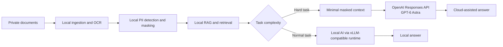

# Local AI + GPT-6 Privacy Guide — Design

วันที่: 4 กันยายน 2026  
สถานะ: อนุมัติแนวทางในแชตแล้ว  
ชื่อ GitHub repository: `local-ai-gpt6-privacy-guide`  
การเผยแพร่: Public ภายใต้บัญชี GitHub ที่กำลังใช้งาน

## 1. เป้าหมาย

สร้าง GitHub repository ภาษาไทยเป็นหลัก เพื่ออธิบายแนวคิด Hybrid AI ที่แบ่งงานดังนี้:

1. งานเอกสารภายใน การค้นหา และ RAG ทำในเครื่องด้วยซอฟต์แวร์ Open Source
2. ข้อมูลที่อาจระบุตัวบุคคลหรือเป็นความลับต้องผ่าน Data Masking ในเครื่อง
3. ส่งเฉพาะบริบทที่จำเป็นและถูก mask แล้วไปยัง OpenAI GPT-6 Astra ผ่าน Responses API
4. ผู้ใช้ macOS, Windows และ Linux เข้าใจได้ว่าต้องปรับเส้นทาง Local AI อย่างไร

Repository นี้เป็นคู่มือเชิงหลักการพร้อมตัวอย่างโค้ดสั้น ๆ ไม่ใช่แอปพลิเคชันพร้อมใช้งาน และจะไม่ติดตั้ง vLLM, ดาวน์โหลดโมเดล, เรียก API จริง หรือเปลี่ยนการตั้งค่าบนเครื่องที่ใช้สร้าง repository

## 2. กลุ่มผู้อ่าน

- บุคคลหรือทีมขนาดเล็กที่ต้องการเริ่ม Hybrid AI โดยไม่ซื้อ GPU server แยก
- ผู้ใช้ Mac mini หรือ Mac รุ่น Apple Silicon
- ผู้ใช้ Windows ที่สามารถใช้ WSL2
- ผู้ใช้ Linux ที่ต้องการใช้ vLLM เป็น local inference server
- ทีมที่ต้องจัดการข้อมูลลูกค้า เอกสารบริษัท หรือข้อมูลภาษาไทยที่มี PII

README ใช้ภาษาไทยเป็นหลักและมี English summary สั้น ๆ เพื่อให้ผู้อ่านต่างประเทศเข้าใจขอบเขตของโครงการ

## 3. ขอบเขตเวอร์ชันแรก

### รวมในเวอร์ชันแรก

- ภาพรวมแนวคิดและประโยชน์ด้าน privacy/cost
- Mermaid architecture diagram ที่ GitHub แสดงผลได้โดยตรง
- Data flow ตั้งแต่ไฟล์ภายในจนถึง GPT-6 Astra API
- แนวทาง Local RAG และ Data Masking โดยใช้เครื่องมือ Open Source
- ตารางแยก macOS, Windows/WSL2 และ Linux พร้อมข้อจำกัดของ vLLM
- ตัวอย่าง Python ที่ส่งเฉพาะข้อความสังเคราะห์ซึ่งผ่าน masking แล้วไปยัง Responses API
- การใช้ model ID `gpt-6-astra` และ `store=False`
- คำเตือนว่า `store=False` ไม่เท่ากับ Zero Data Retention และ masking ไม่รับประกัน anonymization
- แนวทางจัดการ API key, logging, consent, retention และ incident reporting
- MIT License และแนวทาง contribution/security สำหรับ public repository
- พื้นที่และกติกาสำหรับเพิ่มภาพหน้าจอภายหลัง

### ไม่รวมในเวอร์ชันแรก

- การติดตั้งหรือรัน vLLM/vLLM-Metal บนเครื่องนี้
- การดาวน์โหลด model weights หรือการเลือกโมเดลแทนผู้อ่าน
- เว็บ UI, chatbot, vector database หรือ RAG service ที่ทำงานจริง
- การเรียก OpenAI API ด้วย API key จริง
- การรับประกันว่าข้อมูลถูก anonymize สมบูรณ์
- การอัปโหลดไฟล์ต้นฉบับไปยัง OpenAI
- Cloud deployment, authentication, multi-user access หรือ production hardening

## 4. แนวทางที่เลือก

เลือก **documentation-first guide พร้อม safe illustrative snippet** แทน single README ที่สั้นเกินไปหรือ full demo ที่เกินขอบเขต

เหตุผล:

- ตรงกับคำขอที่ต้องการ “หลักการขึ้น GitHub”
- อธิบาย privacy boundary ได้ชัดกว่าการแจกสคริปต์ติดตั้งแบบกดตาม
- ไม่ทำให้ผู้อ่านเข้าใจผิดว่า vLLM รองรับทุกระบบด้วยขั้นตอนเดียว
- ตรวจสอบความถูกต้องของเอกสารและ syntax ได้โดยไม่ใช้ API key หรือดาวน์โหลดโมเดล

## 5. สถาปัตยกรรมที่อธิบายในคู่มือ



หลักการสำคัญ:

- Local processing เป็นค่าเริ่มต้น
- Cloud escalation ต้องเกิดหลัง masking และ context minimization เท่านั้น
- ห้ามส่งไฟล์ต้นฉบับ, path ภายใน, token map, log หรือ metadata ที่ไม่จำเป็น
- ผู้ใช้ต้องเห็น masked preview และยืนยันก่อนส่งข้อมูลขึ้น Cloud
- หาก detector ไม่มั่นใจ ระบบตัวอย่างต้องแนะนำให้หยุด ไม่ใช่ส่ง raw text เพื่อให้ workflow เดินต่อ

## 6. Platform model

คู่มือจะอธิบาย platform support อย่างตรงไปตรงมา:

| ระบบ | แนวทางที่อธิบาย | ข้อจำกัดสำคัญ |
| --- | --- | --- |
| Linux | vLLM เป็นเส้นทางหลักสำหรับ GPU/CPU ที่รองรับ | ต้องตรวจ hardware, driver และ model license |
| Windows | ใช้ vLLM ภายใน WSL2; ไม่เรียกว่า native Windows | GPU acceleration ต้องอาศัย WSL/CUDA ที่รองรับ |
| macOS Apple Silicon | ใช้ vLLM CPU แบบ experimental หรือ community `vllm-metal` | ไม่เทียบเท่า Linux CUDA และต้องตรวจรุ่น macOS/Python/model support |

คู่มือจะไม่อ้างว่า `pip install vllm` ชุดเดียวทำงานเหมือนกันทุกระบบ

## 7. Open Source boundary

ซอฟต์แวร์ Local ที่ยกเป็นตัวอย่างต้องมี license ชัดเจน เช่น vLLM, Presidio, PyThaiNLP และ local vector store ที่มี permissive license

ต้องแยกคำว่า **Open Source software** ออกจาก **open-weight model** อย่างชัดเจน เพราะ license ของ runtime ไม่ได้ทำให้ model weights มี license เดียวกัน ผู้อ่านต้องตรวจ model card, license, commercial-use terms และ attribution ของโมเดลที่เลือกเองทุกครั้ง

Repository จะไม่มี model weights และจะไม่ระบุว่าโมเดลใดเป็น Open Source หากไม่มีลิงก์ license จากเจ้าของโมเดล

## 8. Data Masking และ Thai PII

หมวดข้อมูลขั้นต่ำที่คู่มือกล่าวถึง:

- ชื่อและนามสกุล
- อีเมลและเบอร์โทรศัพท์
- เลขบัตรประชาชนไทย 13 หลัก พร้อม checksum
- เลขบัญชี/พร้อมเพย์
- ที่อยู่และสถานที่
- เลขลูกค้า เลขพนักงาน HN/AN หรือรหัสเคสภายใน
- ชื่อบริษัท โครงการ และความลับทางธุรกิจ

ลำดับที่แนะนำ:

1. Normalize Unicode และตัวเลขไทย/อารบิกในเครื่อง
2. ตรวจด้วย rule/checksum และ NER ที่เหมาะกับภาษาไทย
3. แทนค่าด้วย stable opaque token เช่น `[[PERSON:7F2A]]`
4. แสดง preview และให้ผู้ใช้อนุมัติ
5. ทำ retrieval แล้วตรวจ masking ซ้ำก่อน egress
6. ส่งเฉพาะ chunk ที่จำเป็น

คำเตือนที่ต้องปรากฏเด่นชัด:

- detector อัตโนมัติอาจพลาดหรือ mask เกิน
- OCR ผิดทำให้ตรวจ PII พลาดได้
- ข้อมูลหลายชิ้นที่ดูไม่ระบุตัวบุคคลอาจนำมารวมกันจนระบุตัวบุคคลได้
- encrypted data และ embeddings ยังเป็นข้อมูลอ่อนไหว ไม่ใช่ข้อมูลสาธารณะ
- ห้ามใช้ข้อมูลจริงใน fixture หรือตัวอย่างของ repository

## 9. OpenAI API boundary

ตัวอย่างใช้ OpenAI Responses API และ model ID `gpt-6-astra` ตาม official OpenAI documentation โดยกำหนดโมเดลผ่าน `OPENAI_MODEL` และให้ค่าเริ่มต้นเป็น `gpt-6-astra`

ตัวอย่างต้องมีคุณสมบัติดังนี้:

- อ่าน API key จาก `OPENAI_API_KEY` เท่านั้น
- ไม่ hardcode หรือพิมพ์ API key
- ส่งเฉพาะข้อความสังเคราะห์ที่ผ่าน masking แล้ว
- ตั้ง `store=False`
- มี marker ที่ตรวจว่าข้อความดิบที่ใช้ใน demo ไม่หลุดไปใน request payload
- อธิบายว่า GPT-6 Astra กำลังทยอยเปิดสิทธิ์ และ API key ของผู้อ่านอาจยังไม่มี access
- ไม่ทำ retry ด้วย raw data เมื่อ masking หรือ API call ล้มเหลว

เอกสารต้องบอกว่าข้อมูล API โดยปริยายอาจปรากฏใน abuse-monitoring logs และการได้ Zero Data Retention/Modified Abuse Monitoring ต้องผ่านการอนุมัติของ OpenAI; `store=False` เพียงอย่างเดียวไม่ใช่หลักฐานว่าองค์กรมี ZDR

## 10. โครงสร้าง repository

```text
local-ai-gpt6-privacy-guide/
├── README.md
├── LICENSE
├── SECURITY.md
├── CONTRIBUTING.md
├── .env.example
├── .gitignore
├── assets/
│   └── README.md
├── docs/
│   ├── architecture.md
│   ├── open-source-stack.md
│   ├── openai-api.md
│   ├── platforms.md
│   ├── privacy-and-data-masking.md
│   └── superpowers/specs/2026-09-04-local-ai-gpt6-privacy-guide-design.md
└── examples/
    ├── README.md
    └── openai_responses_masked.py
```

## 11. Error handling ที่เอกสารต้องสอน

- PII confidence ต่ำหรือ OCR ผิด: block egress และให้ตรวจด้วยคน
- Local RAG ไม่พบข้อมูล: ตอบว่าไม่พบ ไม่เติมข้อมูลขึ้นเอง
- GPT-6 Astra access ไม่พร้อม: แสดงข้อผิดพลาดเรื่องสิทธิ์โดยไม่เปลี่ยนโมเดลเงียบ ๆ
- API timeout/rate limit: retry เฉพาะ masked payload เดิมภายใต้จำนวนครั้งจำกัด
- Secret missing: หยุดก่อนสร้าง client และไม่แสดงค่าจาก environment
- Logging: เก็บเฉพาะ event, count, policy version และ hash ที่ไม่ย้อนกลับ ไม่เก็บ prompt/chunk ดิบ

## 12. การตรวจสอบโดยไม่ติดตั้งระบบจริง

ก่อนเผยแพร่ต้องผ่าน:

1. ตรวจ file inventory ว่าตรงกับขอบเขต
2. `python -m py_compile examples/openai_responses_masked.py`
3. ตรวจว่า repository ไม่มี API key, token หรือ PII จริง
4. ตรวจว่า example ไม่มี network call เมื่อเรียกด้วย `--dry-run`
5. ตรวจ Mermaid/Markdown links และ relative paths
6. ตรวจข้อความสำคัญ: macOS/Windows caveat, masking limitation, `store=False` limitation, model access caveat
7. ตรวจ `git diff --check` และ clean working tree หลัง commit
8. หลัง push ให้เปิด public GitHub URL และยืนยัน README, Mermaid, file tree และ visibility จาก remote จริง

## 13. Acceptance criteria

ถือว่างานเสร็จเมื่อ:

- Public repository `local-ai-gpt6-privacy-guide` มีอยู่บน GitHub
- README อธิบาย Local-first, RAG, Data Masking และ GPT-6 escalation ได้ครบ
- macOS, Windows/WSL2 และ Linux มีคำแนะนำและข้อจำกัดที่ไม่ทำให้เข้าใจผิด
- local stack ที่กล่าวถึงเป็น Open Source พร้อมลิงก์ license หรือระบุให้ตรวจ license แยก
- ตัวอย่าง API ใช้ `gpt-6-astra`, Responses API และ `store=False`
- ไม่มี secret, PII จริง, model weights หรือการติดตั้ง Local AI บนเครื่องนี้
- static verification ทุกข้อผ่าน
- public GitHub readback ยืนยันว่าไฟล์และเนื้อหาที่เผยแพร่ตรงกับ local commit

## 14. แหล่งข้อมูลหลัก

- OpenAI GPT-6 Astra: <https://developers.openai.com/api/docs/models/gpt-6-astra>
- OpenAI data controls: <https://developers.openai.com/api/docs/guides/your-data>
- OpenAI API quickstart: <https://developers.openai.com/api/docs/quickstart>
- vLLM GPU installation: <https://docs.vllm.ai/en/latest/getting_started/installation/gpu/>
- vLLM CPU installation: <https://docs.vllm.ai/en/latest/getting_started/installation/cpu/>
- vLLM Metal: <https://github.com/vllm-project/vllm-metal>
- Microsoft CUDA on WSL: <https://learn.microsoft.com/windows/ai/directml/gpu-cuda-in-wsl>
- Microsoft Presidio: <https://microsoft.github.io/presidio/>
- PyThaiNLP: <https://github.com/PyThaiNLP/pythainlp>

